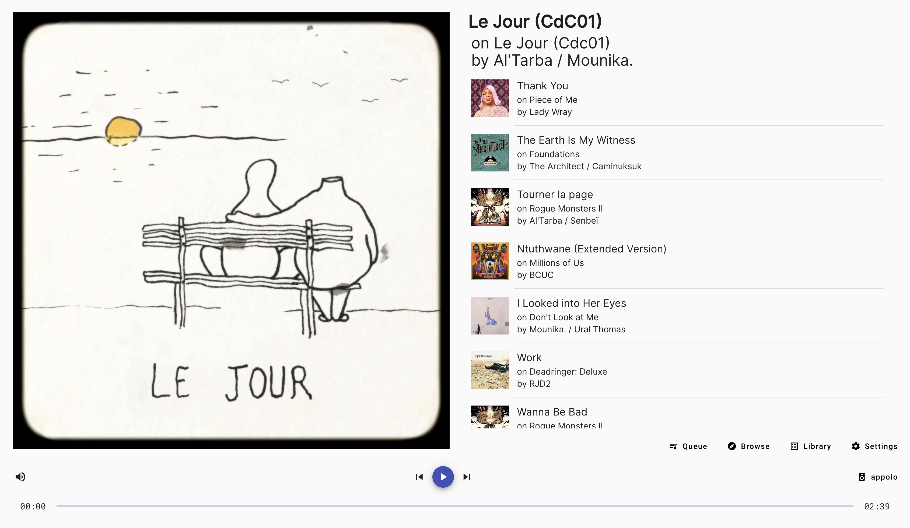
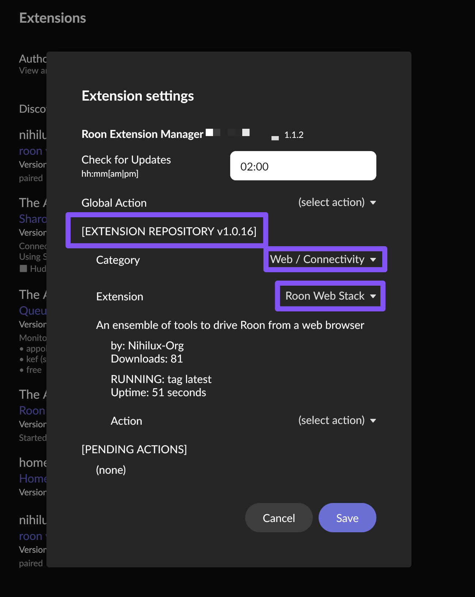
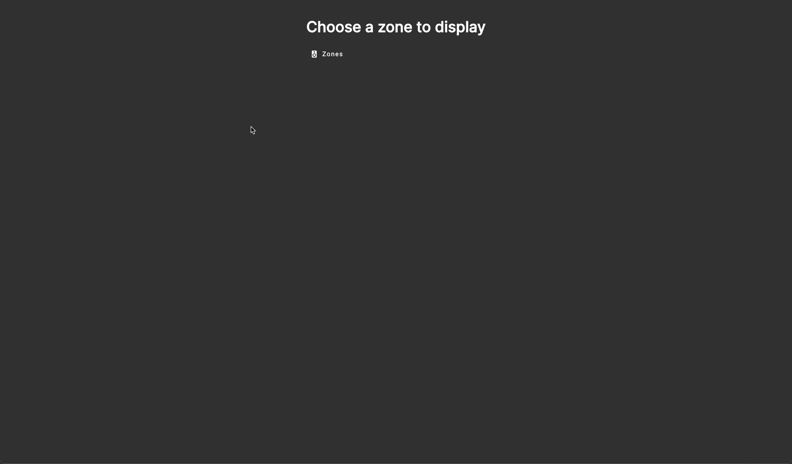
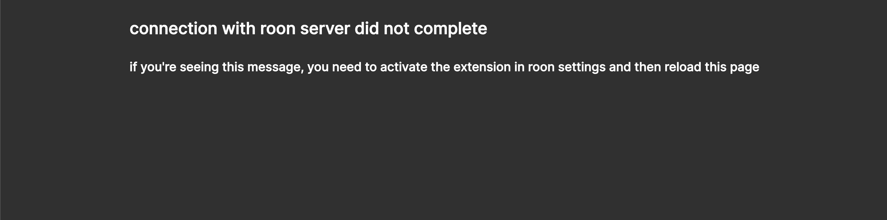
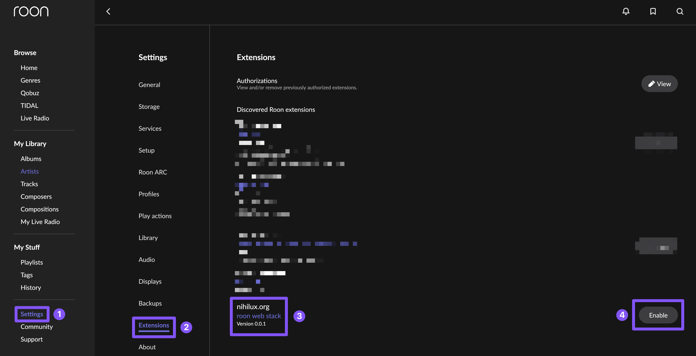

# roon-web-stack

[](https://github.com/nihilux-org/roon-web-stack/actions/workflows/ci.yml)
[](https://github.com/nihilux-org/roon-web-stack/actions/workflows/cd.yml)

An ensemble of tools to drive `roon`, from a web browser.



The final produced artifact is a [`docker` image](https://hub.docker.com/repository/docker/nihiluxorg/roon-web-stack/general) containing a compiled native `Bun` binary serving both an `Angular` app and a [CQRS](https://martinfowler.com/bliki/CQRS.html) http proxy fronting the [node roon api](https://github.com/RoonLabs/node-roon-api). The HTTP server uses `Bun.serve()` natively, with no external framework dependency.

## How to use it

### Using roon-extension-manager

Thanks to [The Appgineer](https://github.com/TheAppgineer), this app is available in [roon extension manager](https://github.com/TheAppgineer/roon-extension-manager/wiki) starting with version `1.0.16` of the repository:



This is the easiest way to use it.  
You can find more info about this tool [on roon forum](https://community.roonlabs.com/t/roon-extension-manager-1-x-currently-at-v1-1-2/161624) or [in its GitHub project](https://github.com/TheAppgineer/roon-extension-manager/wiki).  
Once again, big thanks to [The Appgineer](https://github.com/TheAppgineer), both for the [roon extension manager](https://github.com/TheAppgineer/roon-extension-manager/wiki) and for the integration in the repository.

### Using docker

How to use the `docker` image [available on `docker hub`](https://hub.docker.com/repository/docker/nihiluxorg/roon-web-stack/general):  
```bash
docker run \
-d \
--network host \
--name roon-web-stack \
-e PORT=8282 \
-e LOG_LEVEL=info
-v {somewhere_on_your_host}/config:/usr/src/app/config
nihiluxorg/roon-web-stack
```
- The `network host` setting is needed to enable auto-discovery of your `roon` server.  
It should be possible to make this requirement optional by providing explicit information about the `roon` server to connect with.  
This will be explored later, so for now, this is mandatory.   
- You can configure the `port` with the `-e PORT={port_number}` env variable definition.  
If you don't specify a `port`, the default `3000` will be used.
- You can configure the `log` level via the `-e LOG_LEVEL={level}` env variable definition.  
Supported values are one of `trace|debug|info|warn|error`.  
If you don't set this variable, `info` will be used. 
- The volume mounted by `-v {somewhere_on_your_host}/config:/usr/src/app/config` is here to save the `config.json` file used by the `roon` extension.  
The corresponding `path` is declared as a `volume` in the [Dockerfile](./app/roon-web-api/Dockerfile) and a `symlink` is present to make the `config.json` file accessible to the `node` app.  
This directory must be readable and writable by the user inside the `docker`.

**disclaimer:**  
*The `docker` image is built for `amd64` and `arm64` architectures. 32 bits `ARM` (like Raspberry Pi 2 and older) is not supported.*

### Using docker-compose

Another way to ease all that has been described above is to go with `docker-compose` (or any equivalent solution to lightly orchestrate containers).  
Here is an exemple of a `docker-compose.yaml` (that I use on `dietpi` to run this app at home):

```yaml
services:
  roon-web-stack:
    image: nihiluxorg/roon-web-stack
    container_name: roon-web-stack
    network_mode: host
    volumes:
      - config:/usr/src/app/config
    environment:
      - "PORT=8282"
      - "LOG_LEVEL=info"
volumes:
  config:
```

In this exemple, the `config` volume is created and reused by `docker-compose` without any need to map it to your `host` filesystem.

Once again, there are many ways to achieve this kind of configuration. These exemples are just here to provide indication on what's needed for this [`docker` image](https://hub.docker.com/repository/docker/nihiluxorg/roon-web-stack/general) to work.

### In the browser

Once the container has started, just go to `http://{host}:{port}` with any **modern** browser.  
You should be welcome by the application.  
On first launch, you'll be asked to choose a `zone` to display.  
Choose one, and voilà:



After this first boot, the app will display the last displayed `zone`.

You can change the displayed `zone` with the `zone` selector on the app main screen and via the `settings`:


`Settings` are kind of minimal for now:
- you can choose the theme used
- you can choose between two display modes
- you can select the displayed zone

As features will be added, settings will be added, if needed, to support them.  
These settings are saved in `localstorage`, so they're both linked to the `host` serving the app and to the browser instance they've been set. Changing one of these parameters will reset all settings to their default value.

Using the app should be pretty straight-forward for anyone using `roon`, still, there's a [user guide (with a FAQ) available](./doc/user-guide.md).

### Enabling the extension in roon settings

Don't forget to enable the extension in `roon` settings (might be needed every time you recreate or restart the container if you don't mount the `config` volume).  
If you don't, you'll see this message in the browser:



As a reminder, this is how to enable an extension in `roon` settings:



## How to build it from source

You'll need `Bun` `1.3.9` (as defined in the root `package.json`). See [bun.sh](https://bun.sh) for installation instructions.

Checkout the code and `cd` in the directory.

This `monorepo` uses `Bun` workspaces.

Install dependencies and build:
```bash
bun install
bun run build
```
To launch the `backend` in dev mode (with hot reload, but its not working that well 🤷):
```bash
bun run backend
```
To launch the `frontend` in watch mode:
```bash
bun run frontend
```
Most commands are available at `root` of the `monorepo`:
```bash
bun run lint
bun run build
bun run test
```

If you want to build locally the `docker` image, can use the provided script in `scripts/local-release.zsh`
This script expects `docker` and `buildx` to be installed. Use `-l` because you can't push to the `dockerhub` repo (or I've leaked my tokens and I'm in trouble).
```bash
scripts/local-release.zsh -l
```
Otherwise, simply build the `Dockerfile` with:
```bash
docker build -t nihiluxorg/roon-web-stack:latest -f app/roon-web-api/Dockerfile .
```
Then you can use the `docker` command already mentioned to launch your freshly built image.

## Some context

This project is young and at its very early stage. It's just enough functionalities to be usable and I value the feedback from the community. The idea is to feed further development by these feedbacks.

Also, despite building software for a living, I'm not a `frontend` developer.
My core experiences and expertises are in designing and building distributed and scalable `apis` (`µ-services`, `cloud stuff`, `k8s`, `dbs` and all the usual suspects).

This project was for me an occasion to go back to `web` development (I'd not done that for at least 7 years), helping to deal with some personal stuff in the process.

So, development will be agile, on my personal time. I'm not planning spending more than 3 to 5 hours a week on this project in the future. Otherwise, it should become my job.  
See [what's coming for this project](./doc/what-s-coming.md) to learn how to submit feature request and how to participate in the priorisation process.

Any contribution is welcome, see [CONTRIBUTING](./CONTRIBUTING.md) for info.  

**Constructive** remarks on the [stack choices](./doc/stack-choices.md) or better way to code a modern `Angular` app are also welcome (last project I've worked on as a `fullstack` dev was almost a decade ago, during the early days of `Angular 2`).

## Thanks [Stevenic](https://github.com/Stevenic) for [roon-kit](https://github.com/Stevenic/roon-kit)!

**This `monorepo` includes inlined sources coming from [Stevenic/roon-kit](https://github.com/Stevenic/roon-kit).**

It's stated everywhere it makes sens, and this is one of these places.

See the [README.md](app/roon-web-api/src/roon-kit/README.md) in the corresponding source folder for more details (and here for the [model part](packages/roon-web-model/src/roon-kit/README.md)).

This `monorepo` also includes code copied and adapted from [@bbc/lrud-spatial](https://github.com/bbc/lrud-spatial) in the `lib` `ngx-spatial-navigable`. More precisely, the code in [ngx-spatial-navigable.utils.ts](./app/roon-web-ng-client/projects/nihilux/ngx-spatial-navigable/src/lib/services/ngx-spatial-navigable.utils.ts) is mostly a copy and a `Typescript` conversion of the code in [lrud.js](https://github.com/bbc/lrud-spatial/blob/master/lib/lrud.js) in the [@bbc/lrud-spatial](https://github.com/bbc/lrud-spatial) project. Therefore, the file  [ngx-spatial-navigable.utils.ts](./app/roon-web-ng-client/projects/nihilux/ngx-spatial-navigable/src/lib/services/ngx-spatial-navigable.utils.ts) is published under the original license of the file [lrud.js](https://github.com/bbc/lrud-spatial/blob/master/lib/lrud.js) and should be considered as copyrighted by its original author.
See the header and the `disclaimer` in the header of this file for more details.

## Credits

This app would not have been possible without the vitality of open source projects, so thanks to all of them.

Sorry if I forgot anyone, please don't argue on the order.

- [Stevenic](https://github.com/Stevenic) for [roon-kit](https://github.com/Stevenic/roon-kit)
- [roon](https://roon.app) for [node roon api](https://github.com/RoonLabs/node-roon-api)
- [Angular](https://github.com/angular)
- [Angular Material](https://github.com/angular/components)
- [@bbc/lrud-spatial](https://github.com/bbc/lrud-spatial)
- [Bun](https://bun.sh)
- [nanoid](https://github.com/ai/nanoid)
- [pino](https://github.com/pinojs/pino)
- [ts-retry-promise](https://github.com/normartin/ts-retry-promise)
- [fast-equals](https://github.com/planttheidea/fast-equals)
- [rxjs](https://github.com/ReactiveX/rxjs)
- [vitest](https://github.com/vitest-dev/vitest)
- [typescript](https://github.com/microsoft/TypeScript)
- [Sass](https://github.com/sass/sass)
- [eslint](https://github.com/eslint/eslint) (can't list everything's used, but thanks to everyone!)
- [prettier](https://github.com/prettier/prettier)
- [editorconfig](https://github.com/editorconfig/editorconfig)
- [docker](https://github.com/docker)
- [GitHub](https://github.com), with a special thanks to everyone involved in the `actions` in used in this repo
- [alpine](https://gitlab.alpinelinux.org/alpine/aports)
- [linux and git](https://git.kernel.org)
