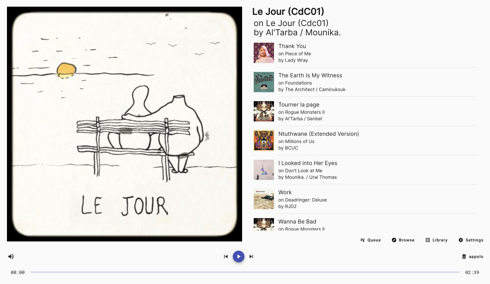

# roon-web-stack

[](https://github.com/nihilux-org/roon-web-stack/actions/workflows/ci.yml)
[](https://github.com/nihilux-org/roon-web-stack/actions/workflows/cd.yml)

A web-based remote control for [Roon](https://roon.app), built with **Bun**, **Angular**, and **Hono**.



The final artifact is a Docker image containing a compiled native Bun binary serving an Angular app and a [CQRS](https://martinfowler.com/bliki/CQRS.html) HTTP proxy built with [Hono](https://hono.dev), fronting the [node roon api](https://github.com/RoonLabs/node-roon-api).

## Features

- **Zone control** — Play, pause, skip, volume, and zone selection
- **Queue management** — View and manage the play queue
- **Browsing** — Navigate your library (artists, albums, tracks)
- **[AirPlay integration](./app/roon-airplay/)** — Receive AirPlay audio and stream to Roon
- **Custom actions** — Define and trigger custom Roon actions
- **4 display modes** — Compact, One Column, Wide, 10 Feet

See the [user guide](./doc/user-guide.md) for detailed feature documentation.

## Quick Start

The easiest way is via [roon-extension-manager](https://github.com/TheAppgineer/roon-extension-manager/wiki).

Or run with Docker:

```bash
docker run -d --network host --name roon-web-stack \
  -e PORT=3000 -e LOG_LEVEL=info \
  -v roon-config:/usr/src/app/config \
  nihiluxorg/roon-web-stack
```

See [getting-started.md](./doc/getting-started.md) for full installation options (Docker, docker-compose, roon-extension-manager).

## Development

Requires [Bun 1.3.14](https://bun.sh).

```bash
bun install
bun run build
bun run backend   # Start API in dev mode
bun run frontend  # Build and serve Angular app
```

See [building.md](./doc/building.md) for detailed build instructions.

## Documentation

| Document | Description |
|----------|-------------|
| [getting-started.md](./doc/getting-started.md) | Installation and deployment |
| [building.md](./doc/building.md) | Build from source |
| [user-guide.md](./doc/user-guide.md) | End-user guide and FAQ |

## Contributing

Contributions welcome! See [CONTRIBUTING.md](./CONTRIBUTING.md) for guidelines.

## Attribution

### roon-kit

This monorepo includes inlined sources from [Stevenic/roon-kit](https://github.com/Stevenic/roon-kit). See the [README.md](app/roon-web-api/src/roon-kit/README.md) and [model README.md](packages/roon-web-model/src/roon-kit/README.md) for details.

### lrud-spatial

Code in [ngx-spatial-navigable.utils.ts](./app/roon-web-ng-client/projects/nihilux/ngx-spatial-navigable/src/lib/services/ngx-spatial-navigable.utils.ts) is adapted from [@bbc/lrud-spatial](https://github.com/bbc/lrud-spatial) and is published under the original license. See the file header for details.

## Credits

- [Stevenic](https://github.com/Stevenic) for [roon-kit](https://github.com/Stevenic/roon-kit)
- [Roon](https://roon.app) for [node-roon-api](https://github.com/RoonLabs/node-roon-api)
- [Angular](https://angular.dev) & [Angular Material](https://material.angular.io)
- [Hono](https://hono.dev) — Fast web framework
- [Bun](https://bun.sh) — JavaScript runtime
- [@bbc/lrud-spatial](https://github.com/bbc/lrud-spatial)
- [RxJS](https://rxjs.dev), [Vitest](https://vitest.dev), [TypeScript](https://www.typescriptlang.org)
- [Pino](https://getpino.io), [nanoid](https://github.com/ai/nanoid)
- [Docker](https://docker.com), [GitHub Actions](https://github.com/features/actions), [Alpine Linux](https://alpinelinux.org)
