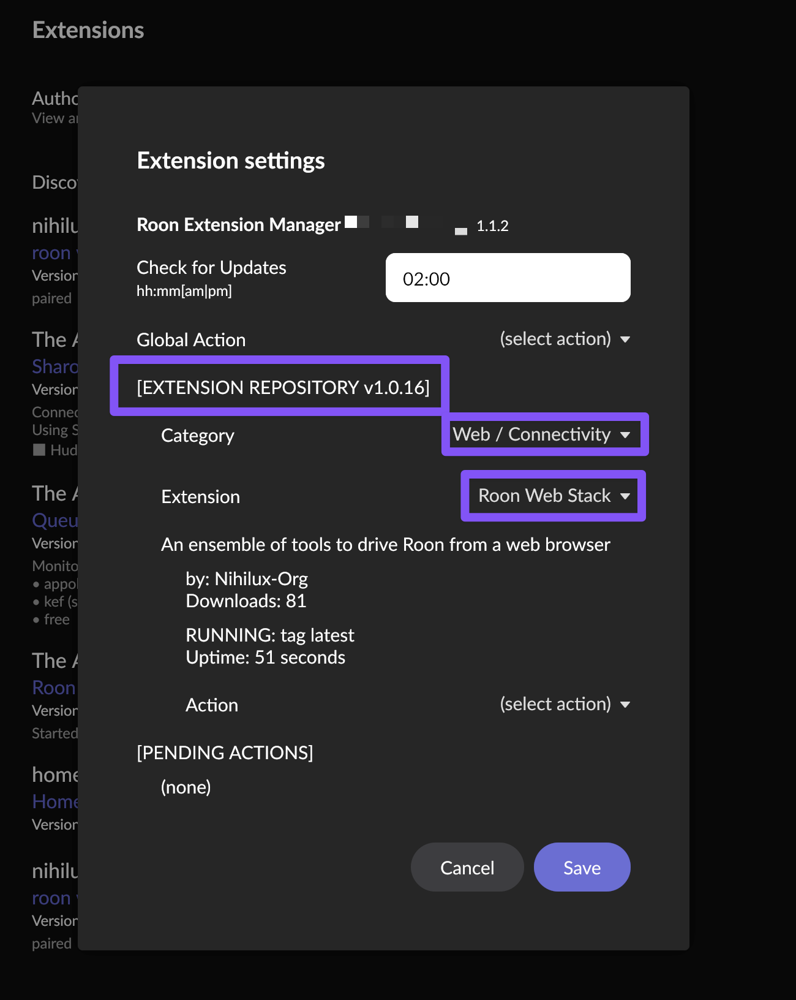
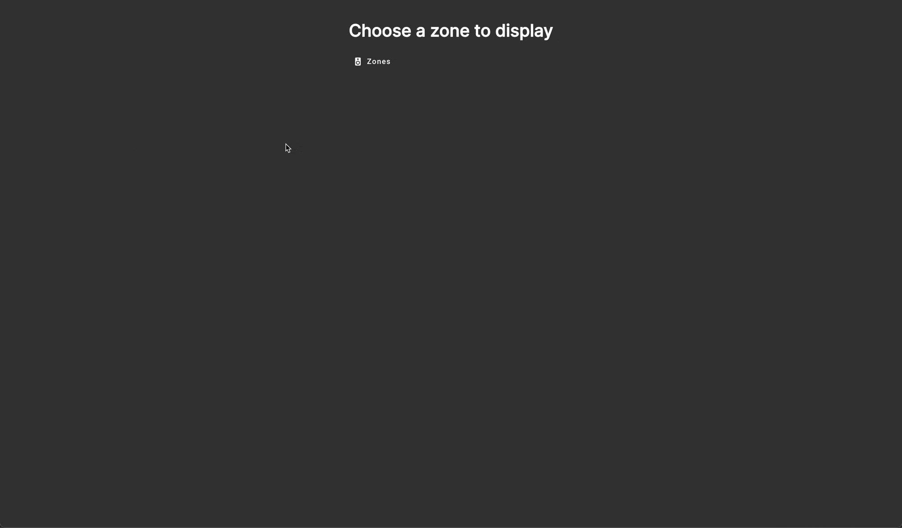
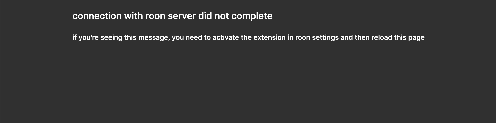
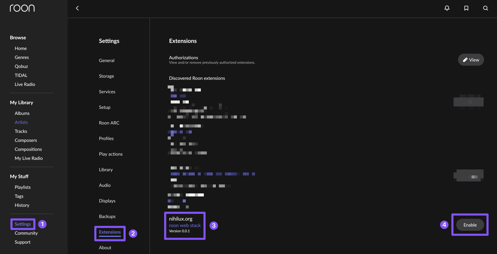

# Getting Started

So you want to use roon-web-stack? Here's how to get it up and running.

## Using roon-extension-manager

Thanks to [The Appgineer](https://github.com/TheAppgineer), this app is available in [roon extension manager](https://github.com/TheAppgineer/roon-extension-manager/wiki) starting with version `1.0.16` of the repository:



This is the easiest way to use it.  
You can find more info about this tool [on roon forum](https://community.roonlabs.com/t/roon-extension-manager-1-x-currently-at-v1-1-2/161624) or [in its GitHub project](https://github.com/TheAppgineer/roon-extension-manager/wiki).  
Once again, big thanks to [The Appgineer](https://github.com/TheAppgineer), both for the [roon extension manager](https://github.com/TheAppgineer/roon-extension-manager/wiki) and for the integration in the repository.

## Using Docker

How to use the `docker` image [available on `docker hub`](https://hub.docker.com/repository/docker/nihiluxorg/roon-web-stack/general):  
```bash
docker run \
-d \
--network host \
--name roon-web-stack \
-e PORT=8282 \
-e LOG_LEVEL=info
-v {somewhere_on_your_host}/config:/usr/src/app/config
nihiluxorg/roon-web-stack:latest
```
- The `network host` setting is needed to enable auto-discovery of your `roon` server.  
It should be possible to make this requirement optional by providing explicit information about the `roon` server to connect with.  
This will be explored later, so for now, this is mandatory.   
- You can configure the `port` with the `-e PORT={port_number}` env variable definition.  
If you don't specify a `port`, the default `3000` will be used.
- You can configure the `log` level via the `-e LOG_LEVEL={level}` env variable definition.  
Supported values are one of `trace|debug|info|warn|error`.  
If you don't set this variable, `info` will be used. 
- The volume mounted by `-v {somewhere_on_your_host}/config:/usr/src/app/config` is here to save the `config.json` file used by the `roon` extension.  
The corresponding `path` is declared as a `volume` in the [Dockerfile](../app/roon-web-api/Dockerfile) and a `symlink` is present to make the `config.json` file accessible to the `bun` app.  
This directory must be readable and writable by the user inside the `docker`.

**disclaimer:**  
*The `docker` image is built for `amd64` and `arm64` architectures. 32 bits `ARM` (like Raspberry Pi 2 and older) is not supported.*

## Using docker-compose

Another way to ease all that has been described above is to go with `docker-compose` (or any equivalent solution to lightly orchestrate containers).  
Here is an exemple of a `docker-compose.yaml` (that I use on `dietpi` to run this app at home):

```yaml
services:
  roon-web-stack:
    image: nihiluxorg/roon-web-stack
    container_name: roon-web-stack
    network_mode: host
    extra_hosts:
      - "host.docker.internal:host-gateway"
    volumes:
      - config:/usr/src/app/config
    environment:
      - "PORT=8282"
      - "LOG_LEVEL=info"
volumes:
  config:
```

In this exemple, the `config` volume is created and reused by `docker-compose` without any need to map it to your `host` filesystem.

Once again, there are many ways to achieve this kind of configuration. These exemples are just here to provide indication on what's needed for this [`docker` image](https://hub.docker.com/repository/docker/nihiluxorg/roon-web-stack/general) to work.

## In the browser

Once the container has started, just go to `http://{host}:{port}` with any **modern** browser.  
You should be welcome by the application.  
On first launch, you'll be asked to choose a `zone` to display.  
Choose one, and voilà:



After this first boot, the app will display the last displayed `zone`.

You can change the displayed `zone` with the `zone` selector on the app main screen and via the `settings`:


`Settings` are kind of minimal for now:
- you can choose the theme used
- you can choose between four display modes
- you can select the displayed zone

As features will be added, settings will be added, if needed, to support them.  
These settings are saved in `localstorage`, so they're both linked to the `host` serving the app and to the browser instance they've been set. Changing one of these parameters will reset all settings to their default value.

Using the app should be pretty straight-forward for anyone using `roon`, still, there's a [user guide (with a FAQ) available](./user-guide.md).

## Enabling the extension in Roon settings

Don't forget to enable the extension in `roon` settings (might be needed every time you recreate or restart the container if you don't mount the `config` volume).  
If you don't, you'll see this message in the browser:



As a reminder, this is how to enable an extension in `roon` settings:



## AirPlay Integration

If you want to stream audio from AirPlay devices (iOS, macOS, iTunes) to Roon, there's a companion container that exposes an AirPlay receiver and converts the audio to an HTTP stream.

The AirPlay receiver runs `shairport-sync` to receive audio, then uses `liquidsoap` to encode it to OGG/FLAC and serves it via HTTP. Roon can then play this stream as an internet radio station. Metadata (artist, title, album) is also forwarded to Roon's display.

For full details on setup and configuration, see the [AirPlay integration documentation](../../app/roon-airplay/README.md).
